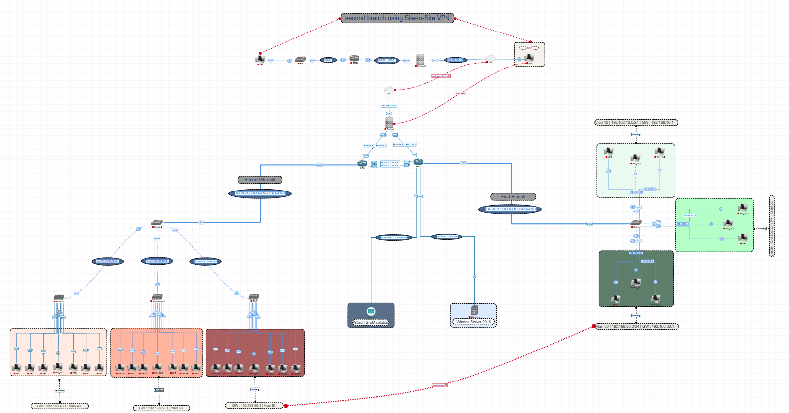
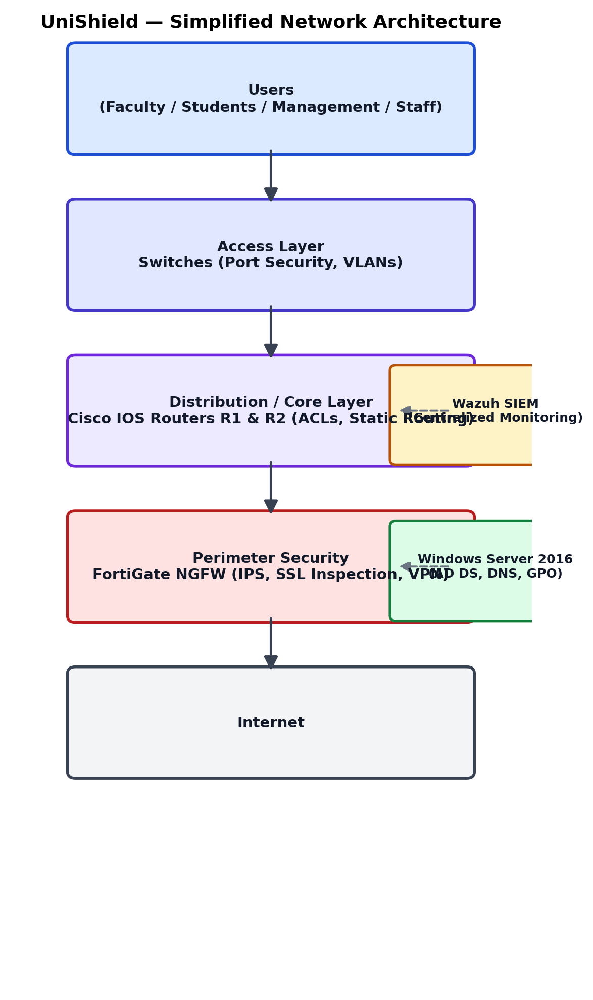

# Network Topology

The network follows a hierarchical enterprise architecture consisting of:

- **Access Layer** — end-user switches, Port Security, VLAN assignment
- **Distribution Layer** — VLAN-aware routing, ACL enforcement
- **Core Layer** — dual redundant Cisco IOS routers (R1, R2)
- **Perimeter Security** — FortiGate NGFW as the sole Internet gateway

## Simplified Architecture Flow

## VLAN Segmentation

| VLAN | Department    |
|------|---------------|
| 10   | Faculty 1     |
| 20   | Faculty 2     |
| 30   | Faculty 3     |
| 40   | Students      |
| 50   | Management    |
| 60   | Staff         |

## IP Addressing

Full interface-by-interface IP addressing scheme for all routers, the FortiGate, Wazuh, and switch management interfaces:

📄 [IP_Addressing.pdf](IP_Addressing.pdf)

## Network Components

- Cisco IOS Routers (R1, R2) — version 15.2
- Cisco Access/Distribution Switches
- FortiGate NGFW (FortiOS 7.0)
- Windows Server 2016 (AD DS, DNS, GPO)
- Wazuh SIEM (Ubuntu 22.04 LTS)
- VMware Workstation Pro 17
- PNETLab

## Key Features

- Router-on-a-Stick sub-interface design
- Dual redundant WAN links (automatic failover)
- Static routing (by deliberate design choice — see report §3.4)
- Access Control Lists (ACLs) for inter-VLAN filtering
- Port Security with Sticky MAC Learning
- Centralized Syslog forwarding to Wazuh SIEM

For full configuration details and testing results, see the [complete project report](../docs/UniShield_Full_Report.pdf).
